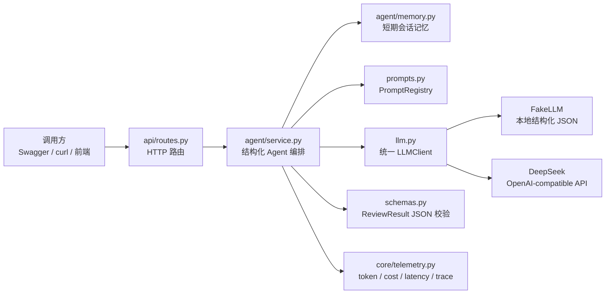

# Day 14 小项目：structured-llm-agent

这是基于 `agent-learning/day7/minimal-chat-agent` 的升级项目。

Day 7 版本重点是“最小可运行多轮聊天服务”：FastAPI 路由、内存会话、配置读取、FakeLLM/DeepSeek 切换和超时保护。Day 14 版本把它升级成一个更结构化、可复用的 LLM 服务，目标对应学习计划里的 Day 14：

- 统一 LLM 接口。
- 支持 prompt 模板。
- 支持 JSON 输出校验。
- 记录 token、成本、延迟。
- 产出一个可复用的 `llm.py` 模块。

## 和 Day 7 的主要差异

- 目录从单层脚本调整为 `app/` 分层结构，避免项目名和包名重复嵌套。
- `llm.py` 定义统一 `LLMClient` 协议，FakeLLM 和 DeepSeek 都返回统一的 `LLMResult`。
- `prompts.py` 提供 `PromptRegistry` 和 `PromptTemplate`，业务层只按模板名调用。
- `ReviewResult` 使用 Pydantic 校验模型 JSON 输出，返回中会暴露 `validation_ok` 和 `validation_error`。
- `telemetry.py` 统一记录 token、成本估算、延迟和 trace。
- API 保留 Day 7 的 `/chat` 和 session 管理，同时新增 `/prompts` 与 `/traces`。

## 目录结构

```text
structured-llm-agent/
  app/
    main.py                 # FastAPI 应用组装
    llm.py                  # 统一 LLM 接口与模型客户端
    prompts.py              # prompt 模板注册与渲染
    schemas.py              # 请求、响应、结构化输出模型
    api/
      routes.py             # HTTP 路由
    agent/
      service.py            # Agent 编排：记忆、prompt、LLM、校验、metrics
      memory.py             # 内存会话历史
    core/
      config.py             # .env 配置读取
      telemetry.py          # token、成本、延迟、trace
  tests/
  requirements.txt
  .env.example
```

## 架构图



## 运行

```powershell
cd agent-learning/day14/structured-llm-agent
python -m pip install -r requirements.txt
python -m uvicorn app.main:app --reload
```

接口文档：

```text
http://127.0.0.1:8000/docs
```

不配置 `DEEPSEEK_API_KEY` 时会自动使用 `FakeLLM`，方便先验证服务结构。

## 请求示例

```json
{
  "user_id": "u001",
  "session_id": "s001",
  "message": "我这周完成了 FastAPI、多轮记忆、超时保护和结构化输出，但对多模型网关还不熟",
  "prompt_template": "weekly_review"
}
```

返回中重点看：

- `review`：经过 Pydantic 校验后的结构化 JSON。
- `metrics.usage`：prompt、completion、total token。
- `metrics.cost`：按 `.env` 中价格估算的成本。
- `metrics.latency_ms`：本次调用耗时。
- `metrics.validation_ok`：模型输出是否通过 JSON schema 校验。

## Day 14 任务对应关系

- 统一 LLM 接口：`app/llm.py` 中的 `LLMClient`、`FakeLLMClient`、`DeepSeekClient`。
- 支持 prompt 模板：`app/prompts.py` 中的 `PromptRegistry`。
- 支持 JSON 输出校验：`ReviewResult` + `StructuredChatAgent._validate_json_output()`。
- 记录 token、成本、延迟：`core/telemetry.py` 和 `/traces` 接口。

## 测试

```powershell
cd agent-learning/day14/structured-llm-agent
python -m unittest discover -s tests
```
