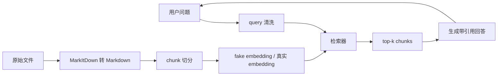

# Day 21：最小 RAG 问答系统

今天的目标是把“文档进入知识库后，如何被检索并带引用回答”跑通一遍。这个练习不是追求复杂框架，而是把 RAG 的核心链路拆成 5 步：

1. 文档清洗：用 MarkItDown 把 PDF、Word、Excel、PPT、HTML、CSV、JSON 等文件统一转成 Markdown。
2. chunk 切分：把长文档切成适合检索的小块。
3. fake embedding：用词频向量模拟 embedding，先理解检索流程。
4. top-k 检索：根据问题找出最相关的 chunk。
5. 带引用回答：回答中标出来源，方便核验和降低幻觉。

## 目录

```text
day21/
  rag_cli.py
  requirements.txt
  sample_docs/
    company-handbook.md
    support_faq.csv
```

## 安装依赖

建议在虚拟环境中安装：

```powershell
cd agent-learning/day21
python -m venv .venv
.\.venv\Scripts\Activate.ps1
python -m pip install -r requirements.txt
```

如果你只是跑内置样例，没有安装 MarkItDown 也能运行，因为代码内置了 Markdown、TXT、CSV、JSON 的 fallback 转换器。要处理 PDF、Word、Excel、PowerPoint、HTML、图片、音频、ZIP 等更多格式，就安装 `requirements.txt`。

MarkItDown 官方仓库：https://github.com/microsoft/markitdown

## 先把文件转成 Markdown

```powershell
python rag_cli.py convert sample_docs --output build/markdown
```

转换后的文件会写到：

```text
build/markdown/
```

这一步对应生产 RAG 系统中的文档解析和清洗层。真实项目里通常还会补充：

- 去页眉页脚、目录、重复水印。
- 抽取标题、负责人、更新时间、权限标签等 metadata。
- 对表格、图片、扫描件做额外处理。

## 运行最小 RAG 问答

```powershell
python rag_cli.py ask "P0 事故多久内要拉起 war room？"
```

你会看到类似输出：

```text
loaded 2 document(s), built 7 chunk(s)

问题：P0 事故多久内要拉起 war room？

基于检索结果，可以这样回答：
P0 事故需要在 10 分钟内拉起 war room，30 分钟内给出第一版影响范围说明。 [1]

引用：
[1] company-handbook.md chunk 4: ## 生产事故响应 P0 事故需要在 10 分钟内拉起 war room...
```

再试几个问题：

```powershell
python rag_cli.py ask "报销超过 5000 元需要谁确认？"
python rag_cli.py ask "为什么 RAG 回答要带引用？"
python rag_cli.py ask "chunk 太小会带来什么问题？"
```

## 核心代码说明

`rag_cli.py` 里有几个关键函数：

- `convert_file()`：优先调用 MarkItDown，把不同格式文件转成 Markdown。
- `split_text()`：按 Markdown 标题、段落和长度切 chunk；需要时可用 `--overlap` 增加相邻 chunk 的上下文。
- `vectorize()`：用词频模拟向量，这是 fake embedding。
- `search()`：计算 query 和 chunk 的余弦相似度，返回 top-k。
- `make_answer()`：用检索结果拼出带引用的抽取式回答。

这个版本没有调用真实大模型，所以答案更像“从原文中摘句子”。这正好适合 Day 21：先把链路跑通，再在后续课程替换成真实 embedding、向量库和 LLM。

## 一次 RAG 请求的完整链路



面试表达时可以这样讲：

> 用户问题进来后，系统先做 query 清洗，然后在已经解析、切分并向量化的文档 chunk 中做 top-k 检索。检索结果会作为上下文交给回答模块，回答必须带引用编号。引用的作用是让用户能回到原文核验，也能帮助我们定位错误来自检索、文档过期还是生成阶段。

## 下一步优化方向

- 把 fake embedding 换成真实 embedding 模型。
- 把内存检索换成向量数据库。
- 增加 metadata filter，比如部门、权限、时间范围。
- 加入 reranker，让 top-k 的排序更稳定。
- 用 LLM 基于引用内容生成自然语言回答。
- 增加 eval 集，记录命中率、引用正确率和答案忠实度。
