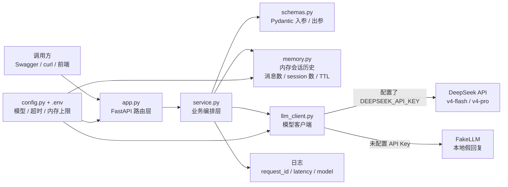
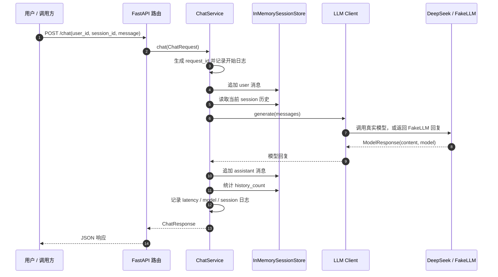

# Day 7 小项目：minimal-chat-agent

这是一个最小多轮聊天后端，用来复盘 Day 1 到 Day 6：

- Day 1：明确 Agent 工程师要做的是可运行系统。
- Day 2：用清晰的数据结构和错误返回。
- Day 3：用 FastAPI 暴露 `/chat`。
- Day 4：配置、日志和 API Key 不写死。
- Day 5：保存会话历史；这里先放内存，不接数据库。
- Day 6：模型调用加超时保护。

## 目录

```text
minimal-chat-agent/
  app.py
  config.py
  llm_client.py
  memory.py
  schemas.py
  service.py
  requirements.txt
  .env.example
```

## 项目架构图



核心分层：

- `app.py`：只负责 HTTP 路由和依赖组装。
- `service.py`：负责一次聊天请求的完整业务流程。
- `memory.py`：保存短期会话历史，并控制内存上限。
- `llm_client.py`：屏蔽真实 DeepSeek 调用和本地 FakeLLM 的差异。
- `schemas.py`：定义请求、响应、消息等数据结构。
- `config.py`：从 `.env` 读取配置，避免把 API Key 写进代码。

## 业务流程图



这条流程里，`session_id` 是短期记忆的关键。同一个 `session_id` 会复用历史；换一个 `session_id` 就会开启一段新的对话。

## 1. 安装依赖

```powershell
cd agent-learning/day7/minimal-chat-agent
python -m pip install -r requirements.txt
```

## 2. 配置 DeepSeek

复制配置文件：

```powershell
copy .env.example .env
```

然后填入你的 key：

```text
DEEPSEEK_API_KEY=你的_api_key
DEEPSEEK_MODEL=deepseek-v4-flash
```

你也可以切到 pro：

```text
DEEPSEEK_MODEL=deepseek-v4-pro
```

如果你的 DeepSeek 兼容接口路径不是 `/v1/chat/completions`，改这里：

```text
DEEPSEEK_CHAT_PATH=/chat/completions
```

如果不填 `DEEPSEEK_API_KEY`，服务会自动使用 `FakeLLM`，方便先验证后端逻辑。

## 3. 启动服务

```powershell
python -m uvicorn app:app --reload
```

打开接口文档：

```text
http://127.0.0.1:8000/docs
```

## 4. 请求示例

```json
{
  "user_id": "u001",
  "session_id": "s001",
  "message": "我今天学了 FastAPI、配置和超时，帮我总结一下"
}
```

返回里重点看：

- `request_id`：本次请求 ID，排查日志用。
- `answer`：助手回复。
- `history_count`：当前会话保存了多少条消息。
- `model`：实际使用的模型，没填 key 时是 `fake-llm`。

内存历史有两个保护：

- `MAX_HISTORY_MESSAGES`：每个 session 最多保留多少条消息。
- `MAX_IN_MEMORY_SESSIONS` + `SESSION_TTL_SECONDS`：限制内存里最多保留多少个 session，以及多久不访问后自动清理。

## 5. 查看会话历史

```text
GET /sessions/s001/messages
```

清空会话：

```text
DELETE /sessions/s001
```

## 6. 这个小项目离真正 Agent 还差什么

现在它只是“多轮 LLM 聊天服务”，还不是完整 Agent。

后续要补：

- 工具调用：让模型能调用 SQL、RAG、Python 等工具。
- 长期记忆：把内存历史换成数据库。
- 结构化输出：让模型稳定返回 JSON。
- Eval：准备测试集评估回答质量。
- Trace：记录每个节点的输入、输出、耗时和错误。
