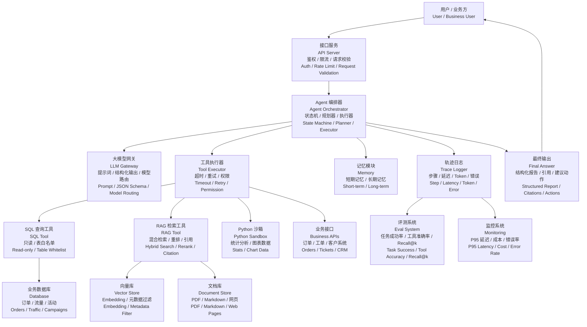

# Agent 系统全景图 / Agent System Map

这张图帮你建立“大厂 AI Agent 开发工程师”的整体架构感。面试时，很多问题都可以落回这张图：模型调用、工具权限、RAG、记忆、评测、观测和部署。

## 读图方法

1. 用户请求先进入 API Server，做鉴权、限流和参数校验。
2. Orchestrator 是 Agent 的大脑，负责维护状态和决定下一步。
3. LLM 不直接操作真实系统，只通过 Tool Executor 间接调用工具。
4. RAG、SQL、Python、业务 API 都是工具。
5. Trace 是生产化关键，没有 trace 就很难排查 Agent 为什么错。
6. Eval 用来证明优化有效，而不是靠主观感觉调 prompt。
