# 84 天学习路径图 / 84-Day Learning Roadmap

这张图对应 [daily-plan.md](../daily-plan.md)。学习时不要只看横向技术名词，要看到能力的递进关系。

```mermaid
flowchart TD
    START["第 1 天 / Day 1<br/>理解岗位画像<br/>Understand the role"] --> W1["第 1 周 / Week 1<br/>Python 工程化<br/>Python Engineering<br/>HTTP / 数据库 DB / 日志 Log / 超时 Timeout"]
    W1 --> W2["第 2 周 / Week 2<br/>大模型 API<br/>LLM API<br/>提示词 Prompt / JSON / 流式输出 Streaming / 成本 Cost"]
    W2 --> W3["第 3 周 / Week 3<br/>RAG 基础<br/>RAG Basics<br/>文档解析 Parse / 切片 Chunk / 向量化 Embedding / 引用 Citation"]
    W3 --> W4["第 4 周 / Week 4<br/>RAG 进阶<br/>Advanced RAG<br/>混合检索 Hybrid Search / 重排 Rerank / 评测 Eval"]
    W4 --> W5["第 5 周 / Week 5<br/>工具调用<br/>Tool Calling<br/>参数结构 Schema / 权限 Permission / MCP / 审批 Approval"]
    W5 --> W6["第 6 周 / Week 6<br/>Agent 核心模式<br/>Agent Patterns<br/>ReAct / 规划器 Planner / 记忆 Memory / 多智能体 Multi-Agent"]
    W6 --> W7["第 7 周 / Week 7<br/>工作流编排<br/>Workflow Orchestration<br/>图结构 Graph / 检查点 Checkpoint / 人工介入 Human-in-the-loop"]
    W7 --> W8["第 8 周 / Week 8<br/>主项目 v1<br/>Main Project v1<br/>企业数据分析 Agent<br/>Data Analysis Agent"]
    W8 --> W9["第 9 周 / Week 9<br/>生产化能力<br/>Production Readiness<br/>轨迹 Trace / 评测 Eval / 安全 Security / Docker"]
    W9 --> W10["第 10 周 / Week 10<br/>备选项目<br/>Backup Project<br/>AI Coding / DevOps Agent"]
    W10 --> W11["第 11 周 / Week 11<br/>面试专项<br/>Interview Prep<br/>系统设计 System Design / 后端基础 Backend / 算法 Algorithm"]
    W11 --> W12["第 12 周 / Week 12<br/>简历与投递<br/>Resume & Delivery<br/>README / JD 匹配 JD Match / 模拟面试 Mock Interview"]
    W12 --> JOB["目标岗位<br/>Target Role<br/>AI Agent 开发工程师<br/>AI Agent Development Engineer"]
```

## 学习节奏

- 第 1-2 周：先能写稳定服务。
- 第 3-4 周：再能做可靠知识问答。
- 第 5-7 周：进入 Agent 的工具、状态和工作流。
- 第 8-10 周：把知识变成简历项目。
- 第 11-12 周：把项目变成面试表达。
