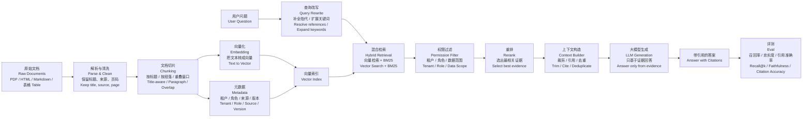

# RAG 检索增强生成流程图 / RAG Pipeline

RAG 不是“向量库 + 大模型”这么简单。完整 RAG 至少包含文档处理、索引、检索、重排、生成和评测。

## 面试抓手

当面试官问“如何优化 RAG”，不要直接说“换 embedding 模型”。按这条链路排查：

1. 文档是否解析干净。
2. chunk 是否保留完整语义。
3. query 是否需要改写。
4. 是否需要混合检索。
5. rerank 是否提升证据质量。
6. 权限过滤是否正确。
7. prompt 是否要求引用和资料不足策略。
8. eval 是否能证明指标提升。
