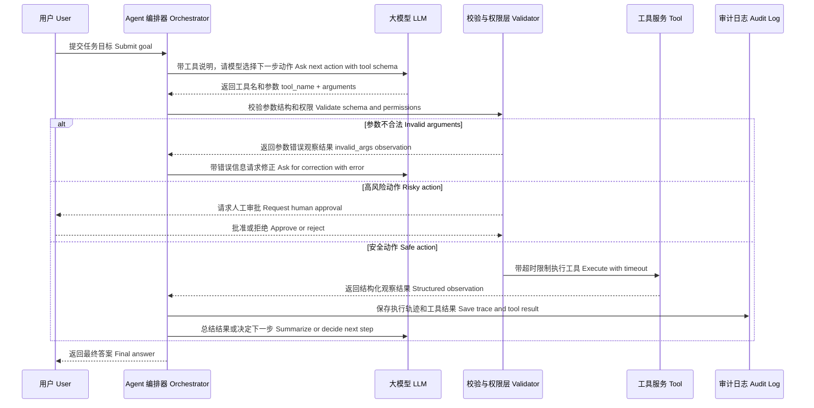

# 工具调用安全链路图 / Tool Calling Safety Flow

工具调用（Tool Calling）的本质是把模型意图转成真实系统动作。安全边界一定在后端工具层，而不是只靠提示词。

## 必须记住

- 模型只提出动作，不直接执行动作。
- 参数必须校验。
- 权限必须在工具层做。
- 高风险动作必须人工确认。
- 每次工具调用都要记录执行轨迹（trace）和审计日志（audit log）。
